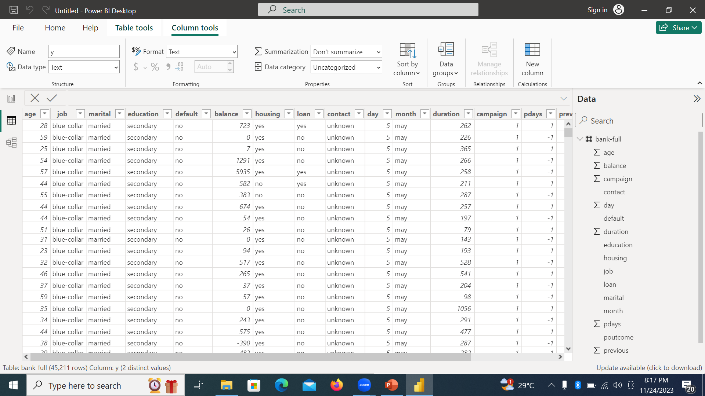
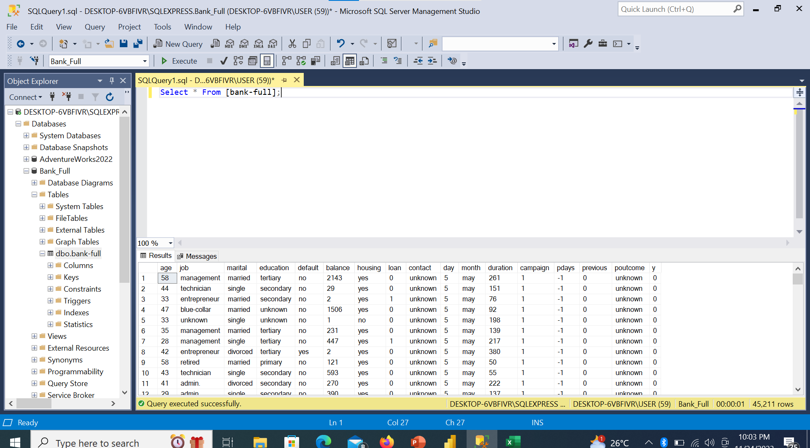
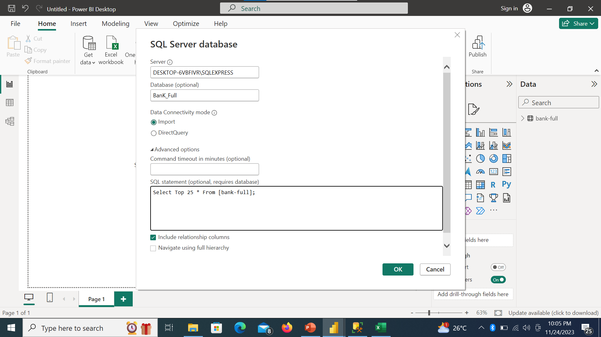
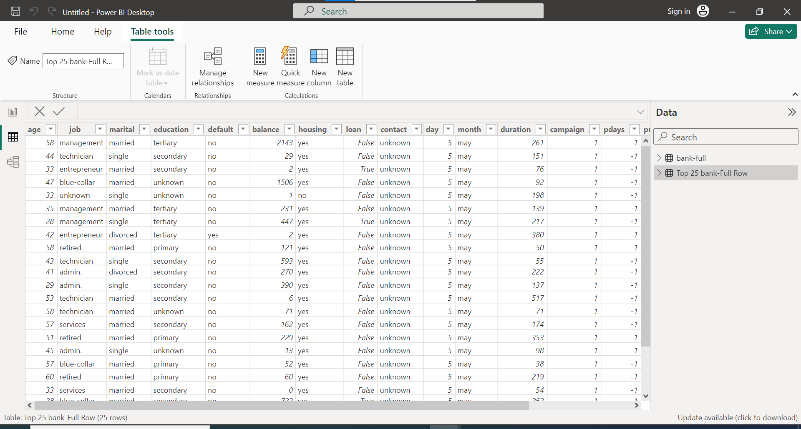
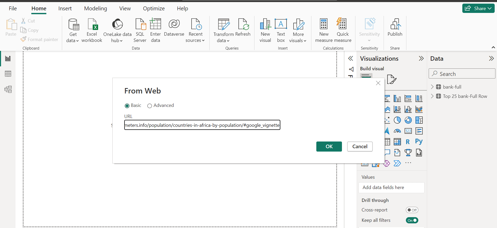
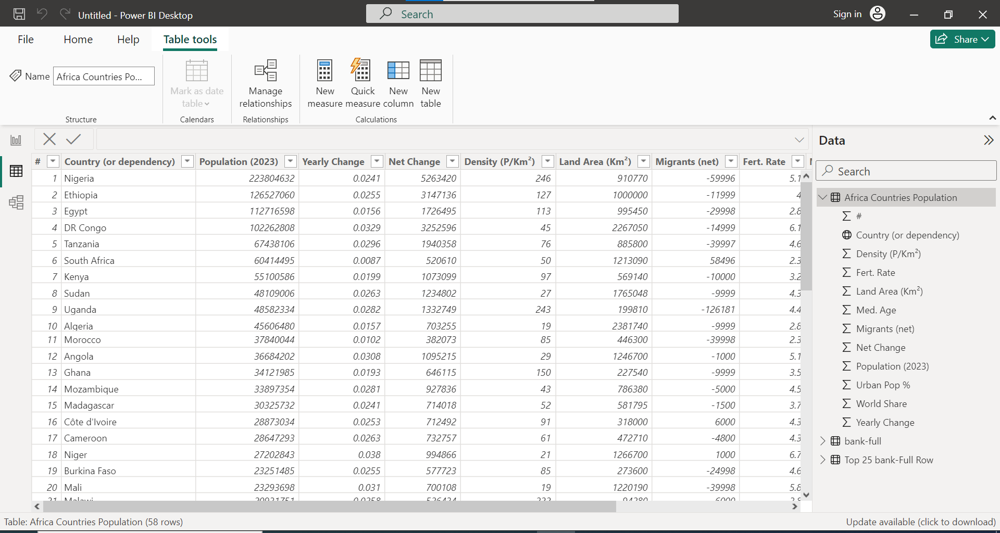

# Importing Bank Term Deposist Subscription

## Introduction

In this Power Bi Task, We were Provided with a Dataset called BankFull in CSV Format. The project is to learn on how to import file from diffirent source into Power Bi.

**_Disclamier_**:_All Dataset do not represent any individual, Institution or company ,but just a dummy set to demonstrate my knowledge of Power Bi._

## Problem Statement
1. Import the Dataset Bank Term Deposist Subscription into PowerBi Using The CSV option.
2. Load the dataset into a database in thea SQL server, connect your powerBi Desktop to the SQl Server and import only the first 25 rows into your Power Desktop for analysis.
3. Import Dataset from the internet using the Web option.

## Skill/ Concepts Documented
    Importing Data using ;
-  CSV option
-  SQL Option
-  WEB Option

 ## Problem Solved

-   Import the Dataset Bank Term Deposit Subscription into PowerBi Using The CSV option.

I open the PowerBi Desktop ,Go to get data, Under get data , click on Text/CSV, then connect,You will see were CSV file are.

Then pick Bank Term Subscription,you will pick the BankFull ,it will take you to a table view . Then you load the Dataset. You view the data to check the format and data type. This particular dataset was in good condition.

          
  -  Load the dataset into a database in the SQL server, connect your powerBi Desktop to the SQl Server and import only the first 25 rows into your Power Desktop for analysis.

  I load the dataset into a database in the Sql Server 

 

    I imported the dataset from the sql server into the PowerBi desktop using the SQl option

     I Use the advance option to filter the first 25 rows

      -  Import Dataset from the internet using the Web option.
I Went to Get Data Icon,click on web,go to the web and type what want to import

I Imported Population for Africa countries

      

      
